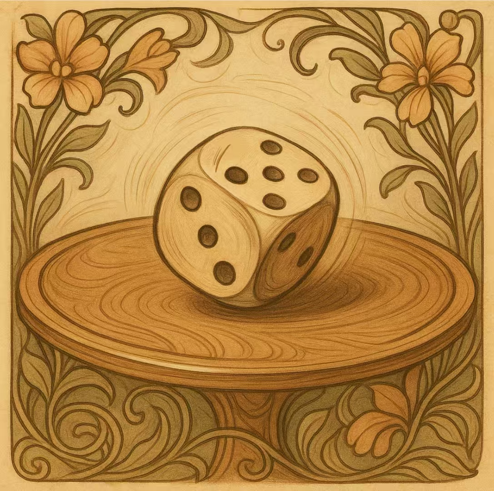

# 🎲 RoundTableDice: A Bluffing Dice Game

```text

Game for RoundTableDice

Setting:
Suppose n people denote as: p1, p2, ..., pn
Each player has m die with 6 sides, $result \in \{1, 2, 3, 4, 5, 6\}$^{m}.

Each game, the players roll their m die, get $\{die_1, ..., die_m\}_{1}, ..., \{die_1, ..., die_m\}_{n}$ respectively. Each player only knows the dies themselves.

Rules:
Start from the player who loses the last game. (Start from the first player if there is no previous game.)

1. In player pi's roll $r$, pi calls a asser that there are $l$ die showing point $k$.
2. For any other players, they can choose whether to question the asser of pi or not.
   1. If pj chooses to question the asser of pi, then all players show their die values.
      1. If in all die values, there are $l'$ die showing point $k$ and $l'_{r} \leq l_{r}$, then player pj loses the game.
      2. Otherwise, player pj wins the game.
      3. Respectively, rule can define that point 1 can represent any point on the die when counting $l'$.
   2. If no other player chooses to question the asser, then next player p_{(i+1) mod n}'s turn.
      1. In next player's roll $r+1$, p_{(i+1) mod n}'s asser about $l_{r+1}$ should satisify $(l_{r+1} > l_{r})$ or $(l_{r+1} = l_{r}$ and $k_{r+1} > k_{r})$.
      2. To 2.
```

---

## 📋 Overview

**RoundTableDice** is a turn-based multiplayer dice game that blends **hidden information**, **bluffing**, and **challenging** mechanics. Each player rolls dice in secret and takes turns making claims about the total dice values. Others can choose to believe or challenge the claim — at their own risk.

---

## 👥 Players and Setup

* **Players:** $n$ players, labeled $p_1, p_2, \dots, p_n$
* **Dice:** Each player has **$m$** standard 6-sided dice
* **Dice Values:** Each die has values in $\{1, 2, 3, 4, 5, 6\}$
* **Visibility:** Players can only see **their own dice**

---

## 🔁 Game Loop

### 🧍 1. Starting the Game

* The player who lost the **previous round** goes first.
* If it's the **first round**, player $p_1$ starts.

---

### 🗣️ 2. Making a Claim (Asser)

On a player's turn, they make a **claim** of the form:

> “There are at least **$l$** dice showing the value **$k$** in total.”

* $l \in \mathbb{N}^+$: number of dice claimed
* $k \in \{1, 2, 3, 4, 5, 6\}$: target die value
* This includes **all players' dice**, not just their own

---

### 🤔 3. Other Players Decide

Each other player, in turn order, may:

* **Pass** (accept the claim)
* **Challenge** (question the truth of the claim)

---

## ❓ Challenge Resolution

If a player $p_j$ challenges:

1. All players **reveal their dice**
2. Count the number $l'$ of dice showing value $k$

### 🧠 Results

* If $l' \geq l$: **challenger $p_j$ loses**
* If $l' < l$: **challenger wins**, and the previous **asser loses**

> 🔁 The **loser** of the challenge becomes the **starting player** for the next round.

---

### ⚠️ Optional Variant: Wild Ones

* Enable the **"Wild One" rule**:
  Dice showing **1** count as **any value** (wildcards).
* Example: Claim is "at least 5 dice showing 3", and there are 3 threes and 2 ones → total = 5 (claim holds)

---

## 🔂 Continuing the Game

If **no one challenges** the claim:

* The turn passes to the next player $p_{(i+1) \bmod n}$
* The new claim $(l', k')$ must be **strictly stronger** than the last:

  * $l' > l$, or
  * $l' = l$ **and** $k' > k$

This ensures **increasing risk** with each round.

---

## 🏁 Ending a Round

* A round ends when a **challenge is made**
* The **loser of the round** starts the next one

---

## 🧮 Optional Scoring

You may assign points to track performance over multiple rounds:

* +1 point for winning a challenge
* –1 point for losing a challenge
* First player to reach a certain number wins

---

## 📌 Example Round

1. **Player 1** claims:
   “There are at least **4 dice** showing **3**”
2. **Player 2** passes
3. **Player 3** challenges
4. Dice revealed:

   * Player 1: \[3, 4, 3, 2, 1]
   * Player 2: \[3, 6, 5, 1, 1]
   * Player 3: \[3, 2, 3, 1, 1]
5. Count of **3s** = 5 → challenge fails
6. **Player 3 loses** and starts the next round

---

## 🖥️ Running the Game

run code:

```bash
python src/UI.py
```

put api-key in api.txt.

---

## Setting

setting

- players
  - simple player count the simplest probability
  - calm player consider the dices on hands and make the conservative decision
  - radical player consider the dices on hands and make the aggressive decision
  - deepseek player deepseek with the content
  - human player human, manual, isopen, point, num

- show history
- hide history

- next turn
- run to the end
